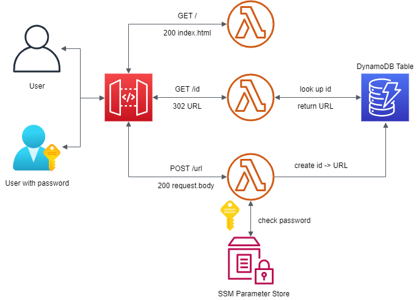
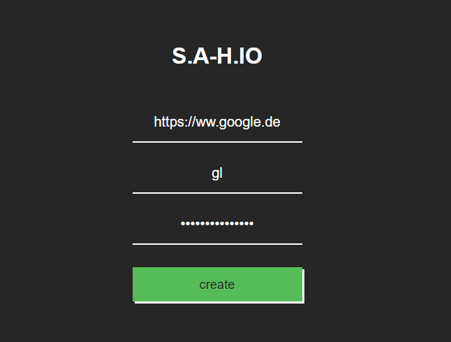

# serverless-url-shortener

A serverless url-shortener made with:

1. AWS ApiGateway
2. AWS Lambda
3. AWS DynamoDB
4. AWS SSM Parameter Store
5. AWS IAM
6. AWS Cloudformation & AWS SAM

The architecture of the project will look like this:



The website will look like this:



Create a secret password for the url-shortener in AWS SSM Parameter Store with the path:

```json
url-shortener/password
```

Deploy with:

```json
sam build && sam deploy --guided
```

Create/Update the name of your DynamoDB table in env.json:

```json
{
    "getByIdFunction": {
        "SAMPLE_TABLE": "url-shortener-sam-LinkTable-XXXXXXX"
    },
    "putItemFunction": {
        "SAMPLE_TABLE": "url-shortener-sam-LinkTable-XXXXXXX",
        "DOMAIN_NAME": "s.a-h.io",
        "PASSWORD_PARAMETER": "url-shortener/password"
    }
}
```

Build and test locally at `http://localhost:3000`:

```json
sam build && sam local start-api --env-vars env.json
```

Build and run tests:

```json
sam build && npm run test
```

Check coding style:

```json
eslint src/
```
